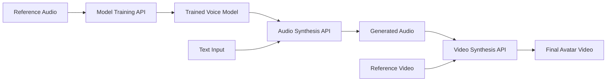

## Overview

Duix Avatar provides three main local APIs that work together to create AI-generated avatar videos:

1. **Model Training API** - Preprocess and train voice models from reference audio
2. **Audio Synthesis API** - Generate speech audio using trained voice models
3. **Video Synthesis API** - Create lip-synced avatar videos from audio and video sources

## Architecture

All APIs run locally on your machine and work completely offline. No data is sent to external servers.



## Base URLs

The APIs are served on different local ports:

<ParamField path="TTS Service" type="string" default="http://127.0.0.1:18180">
  Text-to-Speech service for model training and audio synthesis
</ParamField>

<ParamField path="Face2Face Service" type="string" default="http://127.0.0.1:8383">
  Video synthesis service for lip-sync and avatar generation
</ParamField>

## Workflow

The typical workflow for creating an avatar video:

### 1. Train a Voice Model

First, upload a reference audio file (extracted from your source video) to create a voice model:

```bash
curl -X POST http://127.0.0.1:18180/v1/preprocess_and_tran \
  -H "Content-Type: application/json" \
  -d '{
    "reference_audio": "origin_audio/sample.wav",
    "lang": "zh",
    "format": "wav"
  }'
```

### 2. Generate Audio

Use the trained model to synthesize speech from text:

```bash
curl -X POST http://127.0.0.1:18180/v1/invoke \
  -H "Content-Type: application/json" \
  -d '{
    "speaker": "unique-id",
    "text": "你好，欢迎使用数字人系统",
    "reference_audio": "asr_format_audio/sample.wav",
    "reference_text": "参考文本",
    "format": "wav"
  }' \
  --output output.wav
```

### 3. Create Avatar Video

Submit the generated audio and reference video to create the final avatar video:

```bash
curl -X POST http://127.0.0.1:8383/easy/submit \
  -H "Content-Type: application/json" \
  -d '{
    "audio_url": "audio.wav",
    "video_url": "reference.mp4",
    "code": "task-uuid",
    "chaofen": 0,
    "watermark_switch": 0,
    "pn": 1
  }'
```

### 4. Check Progress

Poll the status endpoint to track video generation progress:

```bash
curl http://127.0.0.1:8383/easy/query?code=task-uuid
```

## Key Features

- **Local & Offline** - All processing happens on your machine
- **No Authentication** - APIs are accessible without credentials (localhost only)
- **Real-time Processing** - Fast audio and video synthesis
- **Customizable** - Fine-tune parameters for quality and performance

## Next Steps

<CardGroup cols={2}>
  <Card title="Authentication" icon="shield-halved" href="/api/authentication">
    Learn about local API access
  </Card>
  <Card title="Model Training" icon="brain" href="/api/model-training">
    Train voice models from audio
  </Card>
  <Card title="Audio Synthesis" icon="microphone" href="/api/audio-synthesis">
    Generate speech from text
  </Card>
  <Card title="Video Synthesis" icon="video" href="/api/video-synthesis">
    Create lip-synced avatar videos
  </Card>
</CardGroup>