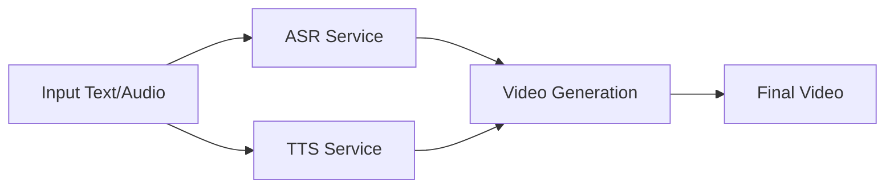

This guide will walk you through creating your first AI avatar and generating your first video using Duix Avatar.

<Note>
Before starting, ensure you have completed the installation for your platform:
- [Windows Installation](/getting-started/windows-installation)
- [Ubuntu Installation](/getting-started/ubuntu-installation)

Verify that all Docker services are running.
</Note>

---

## Verify Services are Running

Before creating your first avatar, confirm all services are operational.

<Tabs>
  <Tab title="Windows">
    Open Docker Desktop and check the Containers section. You should see:
    
    - **duix-avatar-asr** (Running)
    - **duix-avatar-tts** (Running)
    - **duix-avatar-gen-video** (Running)
    
    All three services should show "Running" status.
  </Tab>
  
  <Tab title="Ubuntu">
    Check running containers:
    
    ```bash
    sudo docker ps
    ```
    
    You should see three containers:
    - `duix-avatar-asr`
    - `duix-avatar-tts`
    - `duix-avatar-gen-video`
  </Tab>
</Tabs>

<Warning>
If any service is not running, refer to the troubleshooting sections in the installation guides.
</Warning>

---

## Launch Duix Avatar Client

<Steps>
  <Step title="Open the Application">
    <Tabs>
      <Tab title="Windows">
        Launch Duix Avatar from the Start menu or desktop shortcut.
      </Tab>
      
      <Tab title="Ubuntu">
        Run the AppImage:
        
        ```bash
        ./Duix.Avatar-x.x.x.AppImage
        ```
        
        Or double-click the AppImage file.
      </Tab>
    </Tabs>
  </Step>
  
  <Step title="Familiarize with the Interface">
    The Duix Avatar interface is clean and intuitive, designed for users without technical backgrounds.
  </Step>
</Steps>

---

## Create Your First Avatar

Duix Avatar allows you to clone your appearance and voice to create a digital human avatar.

### Step 1: Prepare Training Materials

<Steps>
  <Step title="Record a Video">
    Record a video of yourself with the following characteristics:
    - **Duration**: 3-5 minutes recommended
    - **Quality**: Clear, well-lit footage
    - **Content**: Speaking naturally, showing facial expressions
    - **Angle**: Face the camera directly
    - **Background**: Clean, minimal background preferred
  </Step>
  
  <Step title="Prepare Audio Sample">
    For voice cloning, you'll need:
    - **Clear audio**: Minimal background noise
    - **Natural speech**: Speak in your normal tone and pace
    - **Duration**: At least 30 seconds to 1 minute
  </Step>
</Steps>

<Note>
**Privacy Protection**: Duix Avatar operates fully offline. Your video and audio data never leaves your computer, ensuring complete privacy protection.
</Note>

### Step 2: Train Your Avatar Model

<Steps>
  <Step title="Start Model Training">
    In the Duix Avatar client:
    1. Navigate to the model creation section
    2. Select your video file
    3. Start the training process
  </Step>
  
  <Step title="Wait for Processing">
    The system will:
    - Separate your video into silent video and audio
    - Analyze facial features and movements
    - Build your digital avatar model
    
    This process may take some time depending on your hardware.
  </Step>
  
  <Step title="Save Your Model">
    Once training is complete, save your avatar model with a descriptive name.
  </Step>
</Steps>

### Step 3: Clone Your Voice

<Steps>
  <Step title="Upload Audio Sample">
    The audio from your training video will be automatically processed for voice cloning.
    
    The voice data is stored in:
    - **Windows**: `D:/duix_avatar_data/voice/data`
    - **Ubuntu**: `~/duix_avatar_data/voice/data`
  </Step>
  
  <Step title="Process Voice Model">
    The TTS (Text-to-Speech) service will:
    - Analyze your voice characteristics
    - Capture intonation, speed, and context
    - Create a voice model for synthesis
  </Step>
</Steps>

---

## Generate Your First Video

Now that you have a trained avatar and voice model, you can generate videos.

### Option 1: Text-Driven Video

<Steps>
  <Step title="Select Your Avatar">
    Choose the avatar model you just created.
  </Step>
  
  <Step title="Enter Your Text">
    Type the text you want your avatar to speak.
    
    **Supported Languages**:
    - English
    - Japanese
    - Korean
    - Chinese
    - French
    - German
    - Arabic
    - Spanish
  </Step>
  
  <Step title="Generate Video">
    Click the generate button. The system will:
    1. Convert your text to speech using your cloned voice
    2. Generate lip-sync animations matching the audio
    3. Render the final video with synchronized audio and video
  </Step>
  
  <Step title="Download Your Video">
    Once processing is complete, preview and download your video.
  </Step>
</Steps>

### Option 2: Voice-Driven Video

<Steps>
  <Step title="Select Your Avatar">
    Choose your avatar model.
  </Step>
  
  <Step title="Upload Audio">
    Instead of text, upload an audio file or record directly.
  </Step>
  
  <Step title="Generate Video">
    The system will:
    - Analyze the audio rhythm and intonation
    - Drive the avatar with corresponding facial expressions
    - Synchronize lip movements with the audio
  </Step>
  
  <Step title="Review and Save">
    Preview the generated video and save it to your desired location.
  </Step>
</Steps>

---

## Understanding the Workflow

Here's how Duix Avatar processes your content:



### Service Roles

<CardGroup cols={3}>
  <Card title="ASR Service" icon="microphone">
    **Port**: 10095
    
    Automatic Speech Recognition converts speech to text for processing.
  </Card>
  
  <Card title="TTS Service" icon="volume-high">
    **Port**: 18180
    
    Text-to-Speech synthesizes audio using your cloned voice model.
  </Card>
  
  <Card title="Video Gen Service" icon="video">
    **Port**: 8383
    
    Generates lip-synced video with your avatar and audio.
  </Card>
</CardGroup>

---

## Data Storage Locations

Understand where your data is stored:

<Tabs>
  <Tab title="Windows">
    | Data Type | Location |
    |-----------|----------|
    | Voice data | `D:/duix_avatar_data/voice/data` |
    | Avatar models & videos | `D:/duix_avatar_data/face2face` |
  </Tab>
  
  <Tab title="Ubuntu">
    | Data Type | Location |
    |-----------|----------|
    | Voice data | `~/duix_avatar_data/voice/data` |
    | Avatar models & videos | `~/duix_avatar_data/face2face` |
  </Tab>
</Tabs>

<Note>
All data remains on your local machine. Duix Avatar operates completely offline after initial setup.
</Note>

---

## Tips for Best Results

<AccordionGroup>
  <Accordion title="Video Quality Tips">
    - Use good lighting when recording your training video
    - Keep your face clearly visible throughout
    - Speak naturally with varied expressions
    - Avoid excessive movement or shaking
    - Use a clean background to avoid distractions
  </Accordion>
  
  <Accordion title="Voice Quality Tips">
    - Record in a quiet environment
    - Use a good quality microphone if possible
    - Speak clearly and naturally
    - Include varied intonations in your sample
    - Longer samples (3-5 minutes) produce better results
  </Accordion>
  
  <Accordion title="Text-to-Speech Tips">
    - Use natural punctuation for better rhythm
    - Shorter sentences often produce better results
    - Preview and adjust if needed
    - Experiment with different text styles
  </Accordion>
  
  <Accordion title="Performance Optimization">
    - Ensure sufficient GPU memory is available
    - Close unnecessary applications during processing
    - Allow adequate time for video generation
    - Monitor Docker container resources
  </Accordion>
</AccordionGroup>

---

## Managing Multiple Models

Duix Avatar supports creating and managing multiple avatar models:

<Steps>
  <Step title="Create Multiple Avatars">
    You can train different avatars for different purposes:
    - Professional avatar for business content
    - Casual avatar for personal videos
    - Different language avatars
  </Step>
  
  <Step title="Switch Between Models">
    Easily switch between your saved models in the client interface.
  </Step>
  
  <Step title="Organize Your Models">
    Use descriptive names to keep your models organized.
  </Step>
</Steps>

---

## Troubleshooting

<AccordionGroup>
  <Accordion title="Video Generation is Slow">
    - **Check GPU Usage**: Ensure your NVIDIA GPU is being utilized
    - **Monitor Resources**: Close unnecessary applications
    - **Verify Services**: All three Docker services must be running
    - **Hardware**: Ensure your system meets recommended specifications
  </Accordion>
  
  <Accordion title="Poor Lip Sync Quality">
    - **Audio Quality**: Ensure clean, clear audio input
    - **Training Data**: Use higher quality training video
    - **Model Update**: Retrain your model with better source material
  </Accordion>
  
  <Accordion title="Voice Doesn't Sound Right">
    - **Longer Sample**: Provide more audio data for training
    - **Clear Audio**: Reduce background noise in training data
    - **Retrain**: Try retraining with a different audio sample
  </Accordion>
  
  <Accordion title="Services Not Responding">
    Check service status:
    
    <Tabs>
      <Tab title="Windows">
        In Docker Desktop, verify all services are "Running". Restart if needed.
      </Tab>
      
      <Tab title="Ubuntu">
        ```bash
        sudo docker ps
        sudo docker restart duix-avatar-gen-video
        sudo docker restart duix-avatar-tts
        sudo docker restart duix-avatar-asr
        ```
      </Tab>
    </Tabs>
  </Accordion>
</AccordionGroup>

---

## Next Steps

Now that you've created your first avatar and video, explore more advanced features:

<CardGroup cols={2}>
  <Card title="API Reference" icon="code" href="/api/introduction">
    Learn how to use Duix Avatar APIs for custom integrations
  </Card>
  
  <Card title="Voice Cloning" icon="microphone" href="/guides/voice-cloning">
    Master voice cloning and audio synthesis
  </Card>
  
  <Card title="Video Synthesis" icon="video" href="/guides/video-synthesis">
    Learn advanced video generation techniques
  </Card>
  
  <Card title="Managing Models" icon="database" href="/guides/managing-models">
    Organize and manage your avatar models
  </Card>
</CardGroup>

---

## Getting Help

If you encounter issues:

<Steps>
  <Step title="Check Documentation">
    Review the [system requirements](/getting-started/system-requirements) and installation guides.
  </Step>
  
  <Step title="Search GitHub Issues">
    Check [GitHub Issues](https://github.com/duixcom/Duix.Avatar/issues) - your question may already be answered.
  </Step>
  
  <Step title="Report Issues">
    When reporting issues, include:
    - Detailed problem description with screenshots
    - Client logs (available in the application menu)
    - Docker service logs
    - System specifications
  </Step>
  
  <Step title="Contact Support">
    For additional help, contact: james@duix.com
  </Step>
</Steps>